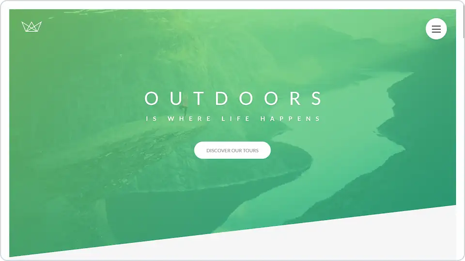
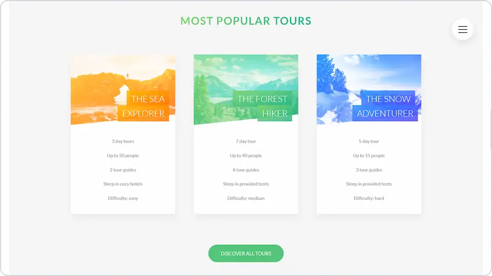

# 

**Demo home page for a fictional company that offers tours in nature.**

## 💻 Screenshot

## 🛠️ Tools and technologies
`Sass` `SCSS` `CSS` `HTML` `JavaScript` `VS Code`

By preparing this project I learned some **advanced CSS and Sass** (with SCSS syntax).

## 🌐 Deployment
Deployed on `Netlify`.

Live preview at [dawidlehai-natours.netlify.app](https://dawidlehai-natours.netlify.app/).

## 🎓 Related course
This project was created as a part of the [Udemy](https://www.udemy.com/ 'Udemy') course [_Advanced CSS and Sass: Flexbox, Grid, Animations and More!_](https://www.udemy.com/course/advanced-css-and-sass/ 'See this course on Udemy') by [Jonas Schmedtmann](https://twitter.com/jonasschmedtman 'Jonas Schmedtmann on Twitter').
